# N A B E E S

<strong>Software Developer · Builder · Creator</strong>

<a href="https://nabees.online">nabees.online</a> &nbsp;·&nbsp; <a href="https://github.com/Nabaikabaia">GitHub</a>

---

## About

I’m **Nabees**, a software developer focused on building practical digital products, APIs, automation systems, and polished web experiences.

I enjoy turning ideas into real, deployable systems — from Cloudflare-powered services and developer tools to creative web platforms and automation projects.

## What I Build

- Modern web applications and interactive interfaces
- REST APIs and developer platforms
- Cloudflare Workers, Pages and edge applications
- Automation and backend systems
- AI-powered tools and integrations
- Media, downloader and content utilities
- Experimental 3D and motion-driven experiences

## Tech Stack

**Languages**

JavaScript · TypeScript · HTML · CSS · Python

**Frontend**

React · Three.js · Vite

**Backend & Cloud**

Node.js · Cloudflare Workers · Cloudflare D1 · REST APIs

**Tools**

Git · GitHub · Linux · Docker

## Selected Work

### Nabees Tech

A growing ecosystem of developer tools, APIs and web products.

**https://nabees.online**

### Nabees APIs

A collection of APIs designed to make common development and media workflows easier to integrate.

### Nabees Image Studio

Image utilities including background removal, enhancement and other AI-powered image workflows.

### All In One Downloader

A modern media utility designed around a fast, simple interface for downloading content from supported platforms.

## Currently Building

- Nabees developer ecosystem
- Cloudflare-native applications
- AI-powered utilities
- Better developer experiences
- Experimental interactive web interfaces

---

## GitHub Activity

 

<strong>BUILD. SHIP. EVOLVE.</strong>

<a href="https://nabees.online">Nabees Tech</a>

